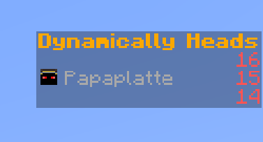

# Dynamically Image Loader

The library allows you to dynamically load avatars (the Player Head) into the Minecraft Resource Pack in Minecraft 1.20.*




> [!NOTE]
> The library depends on a resource pack that is not included in the library. You need to create a resource pack with the necessary textures and load it into the game.

## Installation

### Resource Pack

1. Create a new resource pack or use an existing one.
2. Incorporate the required textures into the resource pack.
3. Download the textures from  [this GitHub Repository](https://github.com/Jilence/dynamically-image-loader/tree/master/resource-packs/dynamically-image-loader/) and integrate them into your resource pack.


4. (Optional) If you prefer to remove shadows, download the [files](https://github.com/Jilence/dynamically-image-loader/tree/master/resource-packs/no-shadow) and insert them into the `assets/minecraft/shaders/core` directory of your resource pack.


### Dependencies

#### Gradle Kotlin DSL

```kotlin
implementation("com.github.Jilence:dynamically-image-loader:v1.0.5")
```

### Repository

```kotlin
maven("https://jitpack.io")
```


## Usage

### Build a Component

```kotlin
val icon = IconBuilder.Builder()
            .withUsername("Player Name")
            .buildAsComponent()
```

### Build a String

```kotlin
val icon = IconBuilder.Builder()
            .withUsername("Player Name")
            .build()
```

You can place the component or string wherever you desire!

**IMPORTANT:** :warning: To embed your player head into the scoreboard, ensure that the scoreboard doesn't have a character limit. I utilized [KTGui](https://github.com/Matt-MX/KtPaperGui) for testing purposes. Feel free to use any tool or method you prefer!


